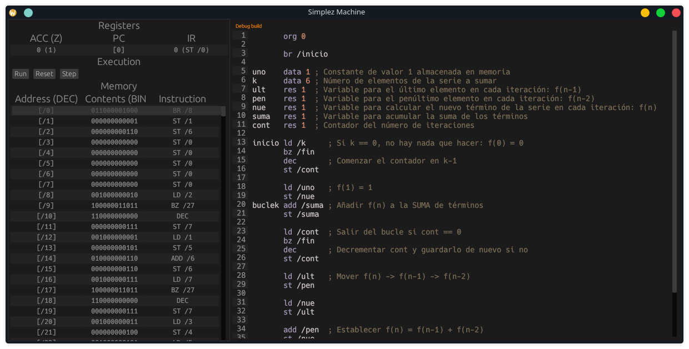

# Simplez Machine

Simplez is a made up architecture that is used by the [Superior Technical School of Engineering at Seville](etsi.us.es). This is an interpreter and assembler that works on web and all desktop platforms, made using Rust and egui for the interface.